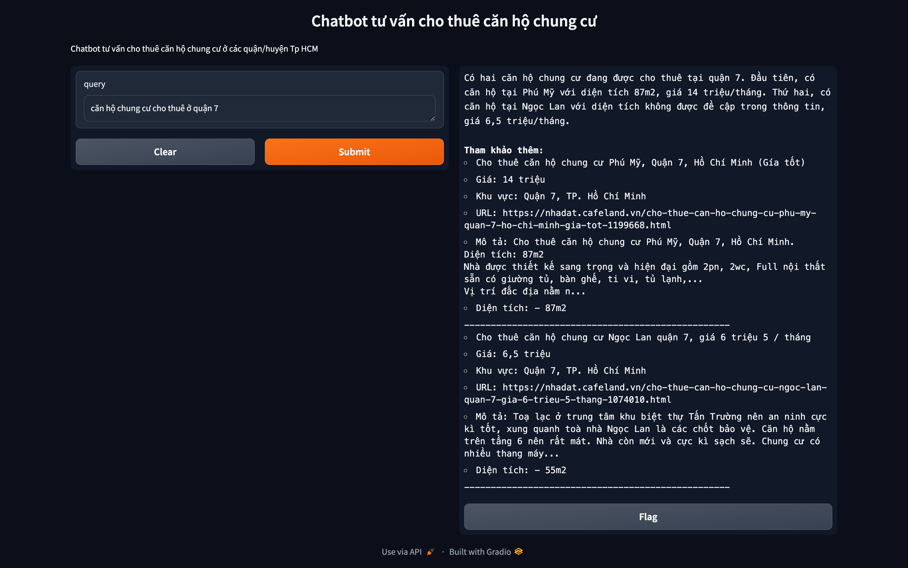

# Chatbot Real Estate renting consultant 

## Install dependencies

- Create env

```
conda create --name vietai python=3.12
```

- Install packages

```
pip install -r requirements.txt
```

## Required env variables

Open your terminal and run these below command

```
export OPENAI_API_KEY=<Your OpenAI key>
```


```
export HF_TOKEN=<Your HuggingFaceAPI key>
```

## Start the app

```
python app.py
```

Notice: The verify time you run the app, if there is not any data collection, it's might takes a few minutes to crawl web data before you can chat

